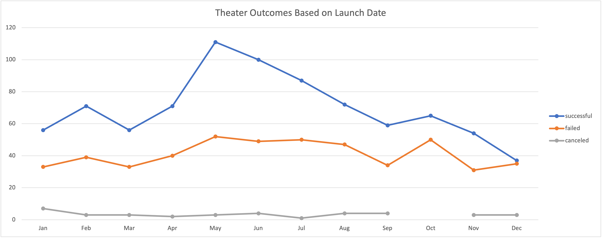
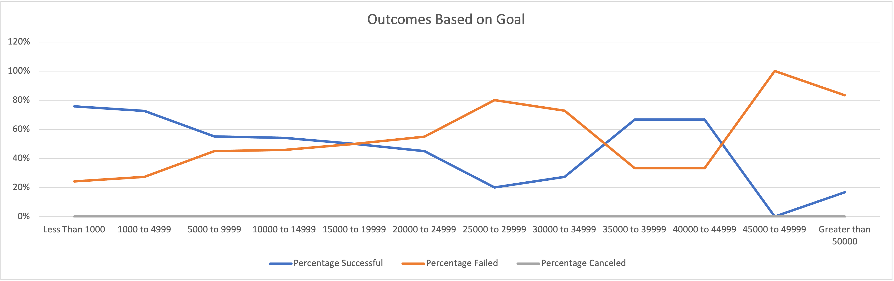

# Kickstarting with Excel

## Overview of Project
Follow Up Analysis after failed Kickstarter campaign for the play "Fever"

### Background
In the following analysis, we will be continuing with the Kickstarter analysis of our friend Louise. This time, she has completed her Kickstarter campaign. It does not appear that she took any of our suggestions from the first analysis, unfortunately. It turns out that Louise still decided to proceed with her request of a $10,000 goal for her new play, Fever. As a result, she still fell short of that goal in fundraising. 

### Purpose
To further understand the successful vs failed outcomes of various campaigns, she wishes to view the analysis results of how different campaigns did in relation to campaign launch dates and fundraising goals. We will provide these results again in new charts to better explain our findings and provide further detail, and we will then finally conclude this analysis with limitations of the data recognized, if any, and further reiterate our recommendations in hopes that she will accept and apply our suggestions accordingly and achieve the results that she is looking for on her next fundraising attempt.

## Analysis and Challenges

### Analysis of Outcomes Based on Launch Date

Louise wanted to know the results of the data for Theater Outcomes based on their launch dates to find out when is the best time to launch a campaign.

As we can see based on this image, the success plays were most successful in May, June, and July as shown by the sharpest and highest peak of the entire success trendline. After periods of low, there were also significant spikes in both February and October. 

Looking at the line that represents failed palys, we can also see that the failed outcomes follow the same trend, yet at a lower number, of course.  The failed outcomes appear to rise in February, is on a higher trend in May, June, July, and August before it falls. Outside of the summer months, As the successful outcomes, the failed outcomes experience a rise on the trend line, but in Octomer, where the sucessline expereicnces a slignht rise of success, there is a sharp increase in failed outcomes. It appears to be the highest failed marking of the entire trend line of failed outcomes. Finally in December, both the successful and failed lines meet. 

In regard to the line of canceled outcomes, the outcomes are quite steady with exception to a slight elevation in January, June, and both August and September. No cancelations are recorded for October due to a gap n the tendline, and there is a leveling in November and December. Overall, the changes are very small and the tren is quite steady.

### Analysis of Outcomes Based on Goals

Louise also wanted a further depiction of the various play campaign goals against their actual campaign outcome.

From the graph of the outcomes based on goals, we can see that the more expensive the goals are, the higher the failure rate becomes. We can see that the market has its moment of maximum tolerance. This is shown by how the successful rate ang failure rate flips from there being more faileures than successes of campaigns. The flips occur first at the 15,000 to 19,999 mark. Here failures continue to be higher than successes untilthe 34,999 mark. The graph flips again with successes being higher than failures at the 35,000 mark and continues until the 44,999 mark, where it then flips a final time. It finally flips to failures being sharply higher than successes for the remaining graphs. 

### Challenges and Difficulties Encountered

Currently, no challenges or difficulties identified based on these results. The information obtained is very informative.

## Results

- What are two conclusions you can draw about the Outcomes based on Launch Date?
  1. The first conclusion that can be made about the Outcomes based on Launch Date, is that summer is the best season for plays. If anyone wants to plan a play outside of the summer, February and October is a good time to plan
  2. The second conclusion is to beware that despite the spike in outcomes in October, the number of failed outcomes is significantly increased in this month of all months, so it is good to be aware of this and plan accordingly to best succeed during this particular month by considering a low budget play to significantly increase chances of a successful campaign and play

- What can you conclude about the Outcomes based on Goals?

  1. The most successful campaigns were those whose campaigns were under $10,000. The campaigns with the greatest chance of success and minimal failure were those campaigns that remained under $5000. Once the campaign exceeds $5000, the success and failure gap begins to shrink, as demonstrated by the chart. Successful campaigns show up again for goals between 35,000 and 45,000 and then falls drastically again. 

- What are some limitations of this dataset?

  1. One limitation on the dataset is the incomplete data for the canceled outcome trendline for the "Theater Outcomes Based on Launch Date". The data for the month of October is completely missing, that we cannot verify that there was not a unique experience during this time frame versus the other months.

  2. Another limitation of this dataset is that the results of the outcomes involve only the data of the KickStarter campaigns, and no other fundraising campaigning systems. The results of this campaign does not represent the industry as a whole and does not represent all fundraising systems used to raise goals. Just because a play failed their fundraising goals here on Kickstarter, does not mean that they did not receive outside funding from elsewhere

- What are some other possible tables and/or graphs that we could create?

  1. A regression analysis can also be done to demonstrate the relationships between the variables provided in the data. 
  

