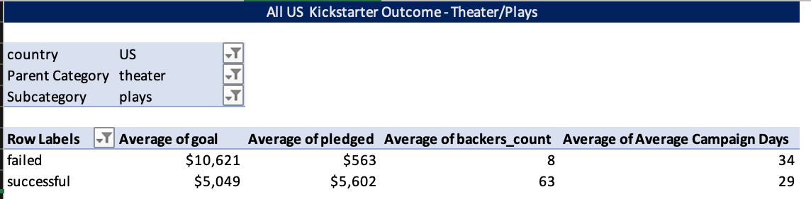
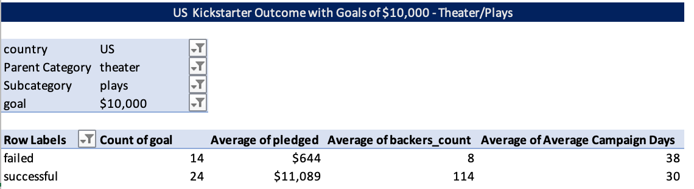
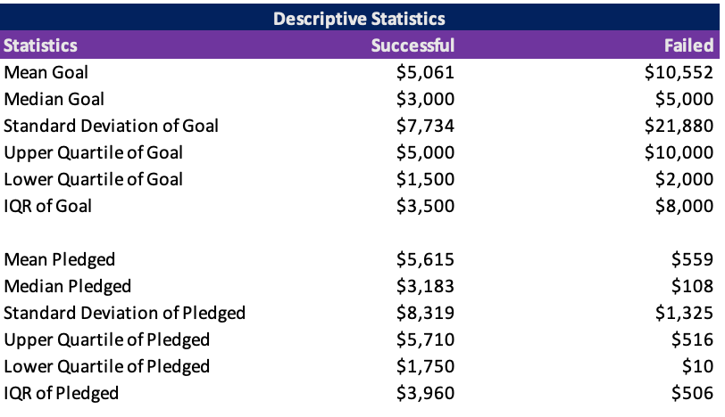
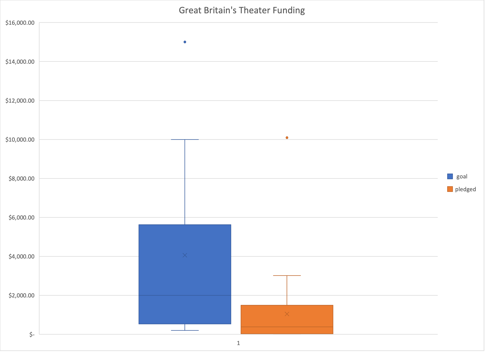

# An Analysis of Kickstarter Campaigns
Performing analysis on Kickstarter data to uncover trends

## Introduction
The following analysis is to assist a playwrite. Our friend Louise will be producing a new project called 'Fever' with a budget of $10,000 and has asked us to analyze other crowdfunding projects to ensure hers obtains the greatest success. We will be looking at the trends of both successes and failures in great detail to formulate the best approach into the business for our friend, so that she breaks a leg when her show becomes LIVE and continues to do so for many successful show nights!

In this analysis, we will take an in depth view of the overall trends associated with the data provided as well as the trends specifically pertaining to Louise's specialized industry. We will answer her important question as to length of successful campaigns, seasons of successful campaigns, trend of success with Louise's planned approach of campaigning for a 10,000 budget, statistical components of our research, results of analyzing the success of Edinburgh plays, and finally, the chance of success and suggestions of approach if Louise attempts to enter into the theater industry of Great Britain with plays. We will then conclude with observations and suggestions to make a successful campaign, both in the short term, and in the long term.

## Industry Overview
In the Kickstarter campaigns, each campaign belongs to both a Parent Category and a Subcategory. Parent categories is a general list of what industry each campagin belongs to, and the subcategories is a more specific type of category within that industry. Similar to cable channels, how there is a channel for sports and a channel for movies. Sports have subcategories such as football, soccer, and rugby sports, while the movie channel has romance, action, and drama movies. Let's take a closer look into the Parent Category and Subcategories of Kickstarter. 

### Parent Category
As we take a general overview to the Kickstarter campaigns for all parent categories, we can see in the chart below that music and theater are the most successful campaigns of all. 

**Photo Here**

Between theater and music, music does run fewer campaigns, but even so, they both have about the similar success rates, but music has very little failed outcomes compared to that of theater. The theater industry almost has as many failures that successes, but successes are still significantly higher.

### Subcategory
Looking deeper into what type of theater performances make up the most campaigns and the most successful campaigns, it would be the subcategory of plays, demonstrated by the following chart:

**Chart**

As we can see, the subcategory of plays far exceed other subcategories both in both successes and failures. It appears to be the driving force of the entire Parent Category of Theater.

Now that we can visibly see how each Parent Category and Subcategory makes up all of the Kickstarter campaigns, we will now take a closer look into the Parent Category of theater and the Subcategories of Plays for our Play producing friend Louise and guide her to a successful Kickstarter campaign of her own using the data obtained from Kickstarter.

## In Depth Views of Data Trends

*Is the length of the fundraising campaign correlated with its success?*

In utilizing the data provided, based on all of the successful plays in the US, the average running time of the fundraising campaign was 29 days. For the failed US plays, the average campaign run was 34 days.

*In what season were the campaigns the most successful?*

Summer was the most successful season for the play campaigns. The month of May was the overall most successful, followed by June, July, and August. Unfortunately, those same months were the months of the highest failure rates as well as shown by the following chart:

Considering that our client is seeking funding of $10,000 for her play, upon observing plays with that goal amount, it was discovered that failed plays seeking 10,000 averaged only $644 in pledge amounts. Campaigns of those plays ran an average of 30 days and they all had an average of only 8 backers. 
The successful plays seeking the same amount averaged a total of 11,089 in pledge amounts and their campaigns ran for an average of 30 days, with an average of 114 backers. The chart of this information can be viewed here:

### Kickstarters Campaign Statistical Components:

The statistical components tells us: 
- The mean of each distribution is in the 3rd quartile and the data follows similar distributions in each subset
- The standard deviation is larger than the mean, which mean that everything below the mean is considered "close" to the center
- Some large values are driving all of these distributions. The standard deviations are all roughly twice the IQR in each distribution, except in the failed Kickstarters, where the standard deviation is closer to three times the IQR. There must be some failed Kickstarters with really high goals!

## Edinburgh Plays

Louise also mentioned that she wanted to know how the Edinburgh Festival Fringe plays were funded. Based on the information obtained, all of the Edinburgh plays were quite successful. They all had an average goal of $2100. Their average pledge exceeded that amount at about $2384. In addition to this, the average donation was $40 and the average number of backers was $62. 

## Great Britain's Theater Market

Louise mentions of her interest in GB's theater market and how she intends to have a budget of 4000 pounds. 

Upon analyzing the data through the use of Box Plots, it shows us that, yes, the mean goal is 4000 pounds. These 4000 pounds are in fact outside of the range of outliers for the amount pledges. It will be ideal for Louise to get the play produces for less than 4000 pounds. Half of the campaign goals are less than 2,000 pounds, which is just over the 3rd quartile for amounts pledged, and 25% of the campaign goals have no pledged amount at all as demonstrated by the lower quartile of pledges beginning on the x-axis. 

As a result, in regard to Great Britain's theater market, it appears to be high risk. If Louise were to proceed with entering the market, she should stick to a budget of no more than 2,000 pounds because this budget appears to be the blueprint of the plays that did survive in this country.

## In Conclusion:

*For Short Term Success*

If Louise wants to produce her play Fever with a budget of $10,000 and no less, she increases her chances of success if she:
1. Considers running her play in the summer. May is the ideal month, followed by June and July
2. Considers advertising her Kickstarter campaign to receive an average of 100 backers, and the campaign run needs to be complete within 30 days
3. Considers advertising for backers externally of the campaign to meet the volume of backers necessary to achieve her financial goal
4. Considers lowering her overall budget to possibly $5,000 or lower to as little as $2,000 to mimick the success of the Edinburgh Festival Fringe plays 

*For Long Term Success*

By now, we understand that based on the data, the number of backers is the key to meeting and exceeding budget goals. Meeting and exceeding budget goals is necessary to be identified as "successful". Repeatedly within the data, it is demonstrated that it took many backers to make a successful play. That being said, Louise could also consider significantly lowering her budget for the play. The lower the budget, the easier it is to obtain enough backers based on curiosity alone in order to fund the play, especially if she is a playwrite without much of a name behind her. 

The average budget of successful plays was $5,000, and the average pledge did exceed this. Lowering her budget could help bring her more immediate success as she continues to build her name in US plays. It is likely that for the higher budgeted plays, many of the individuals pledging are repeat sponsors, versus first time sponsors. If Louise shows she can run a successful play with a minimum budget - proving that she can do more with less, then by the time she runs her next play, she will have acquired some faithful backers to exceed the budget of her next play. Through building up these repeat backers, in a matter of time, she will have enough backers plus some to run a much higher budgeted campaign and have enough volume of repeat backers behind her to exceed even her highest budget and for repeated support to future plays she is to write. The volume of backers, "repeat" backers, is key.

We look forward to the results of Louise's Kickstarter campaign!
